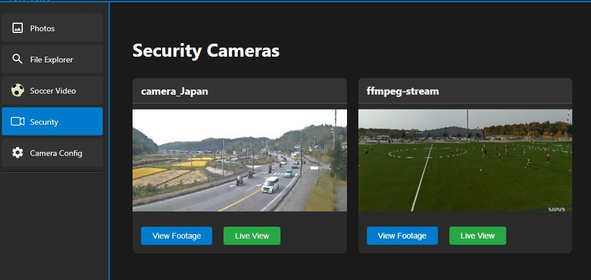
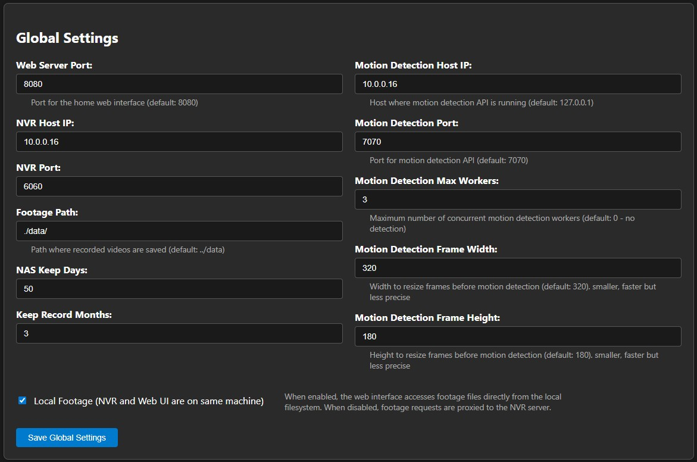
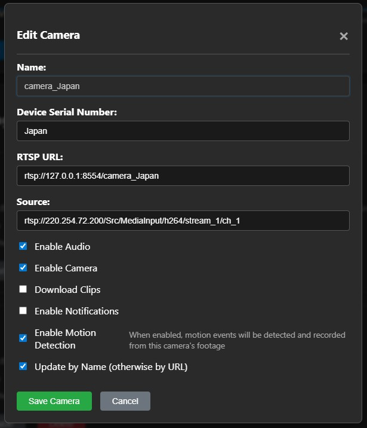
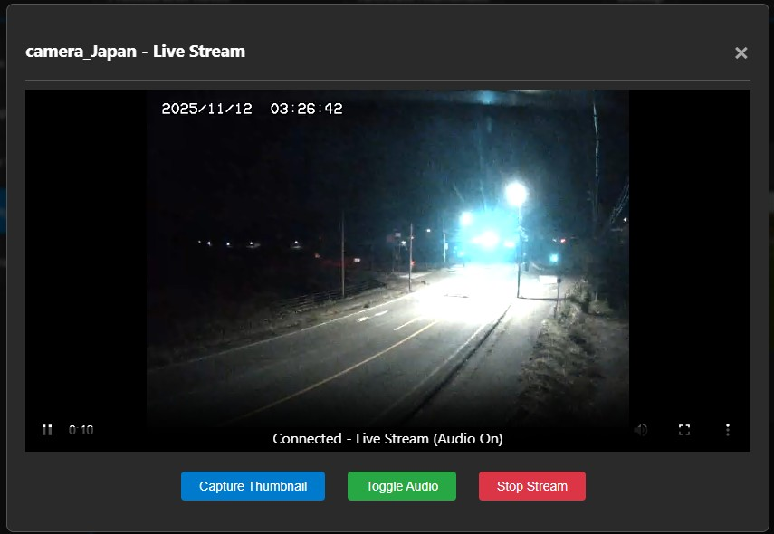
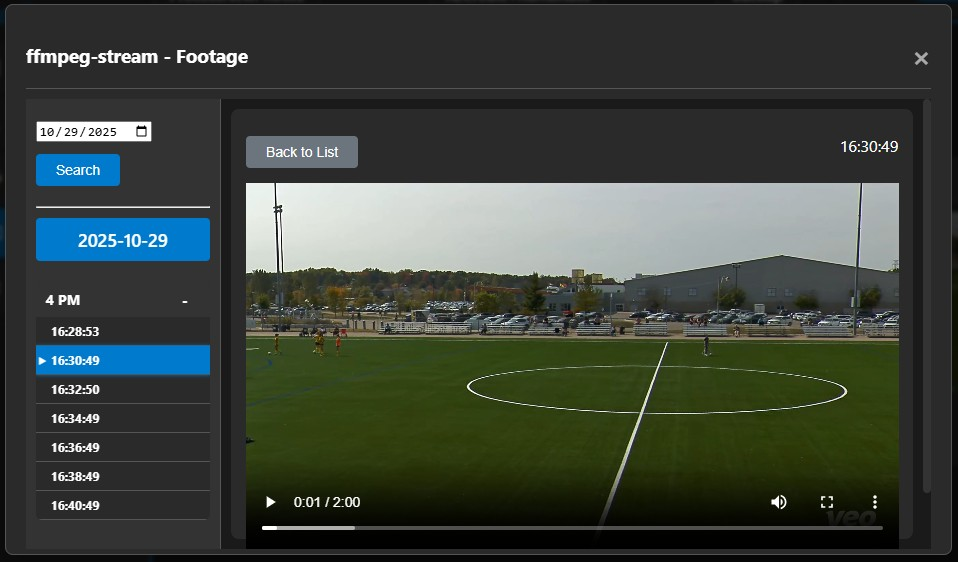

# Home NVR System

A comprehensive Network Video Recorder (NVR) system built with Node.js, featuring real-time video streaming, motion detection, and web-based management interface.



## ✨ Features

### Core Functionality
- **Multi-Camera Support** - Manage multiple RTSP cameras from a single interface
- **Real-Time Streaming** - HLS-based live video streaming with audio support
- **Video Recording** - Automated recording with configurable retention policies
- **Motion Detection** - OpenCV-powered motion detection with object classification
- **Web Interface** - Responsive web UI for camera management and footage review
- **File Upload** - Built-in file upload system for photos and videos
- **Thumbnail Generation** - Automatic thumbnail creation from live streams

### Advanced Features
- **MediaMTX Integration** - RTSP server for camera stream management
- **Dual Server Architecture** - Separate web and NVR services for optimal performance
- **Local/Remote Storage** - Flexible storage options for recorded footage
- **RESTful API** - Complete API for camera and configuration management
- **Session Management** - Secure user sessions with configurable timeouts

## 🏗️ Architecture

The system consists of three main components:

1. **Web Server** (`home.js`) - Handles the web interface, API endpoints, and user interactions
2. **NVR Server** (`nvr.js`) - Manages camera streams, recordings, and video processing
3. **Motion Detection Service** - Cross-platform native application with OpenCV
   - Windows: `libext/win32/motion_server.exe`
   - Linux: `libext/linux/motion_server`

## 📦 Installation

### Raspberry Pi

```bash
#### download install.sh
https://github.com/tyware/node-home-nvr/blob/main/install.sh
chmod +x install.sh

#### install
./install.sh

#### start 3 services
cd node-home-nvr
./start_services.sh
```
### Windows
The below needs to be installed.
1. node.js
2. npm

#### Steps
run cmd.exe (Windows Command Prompt)
```
git clone https://github.com/tyware/node-home-nvr.git node-home-nvr
cd node-home-nvr
node bin/home.js
```
run a new cmd.exe
```
cd node-home-nvr
node bin/nvr.js
```
run the third cmd.exe
```
cd node-home-nvr/libext/win32
motion_server.exe 7070
```
## configure
check Configuration section.

After configure, run below to restart services for Raspberry Pi or manually re-run the above steps for Windows.
```bash
./start_services.sh
```


### Configuration

http://10.0.0.2/8080 (sample)

1. **Global Settings**: Adjust settings like ports, storage paths, and motion detection
set "NVR Host IP", "Motion Detection Host IP", and max motion workers



2. **Cameras Settings**: Add/Edit/Delete camera



3. **Cameras**: View live stream, view footage


View live:


View footage:



### Web Interface

Access the web interface at `http://127.0.0.1:8080`

- **Security Page** (`/`) - Live camera feeds and recorded footage
- **Camera Config** (`/camera-config`) - Camera management and settings
- **Upload Test** (`/test`) - File upload functionality testing

### API Endpoints

#### Camera Management
- `GET /getCameraList` - Get all configured cameras
- `POST /api/camera` - Add new camera
- `PUT /api/camera/:index` - Update camera configuration
- `DELETE /api/camera/:index` - Remove camera

#### Configuration
- `POST /api/config/global` - Update global settings
- `GET /api/security/footage-dates/:camera` - Get available footage dates
- `GET /api/security/footage-hours/:camera/:date` - Get footage for specific date

#### File Operations
- `POST /api/upload/file` - Upload files with optional custom directory
- `POST /api/security/save-thumbnail` - Save camera thumbnails

## 🎯 Motion Detection

### OpenCV-Powered Detection
The system uses a native C++ motion detection service (`motion_server.exe` in Windows, `motion_server` in Raspberry Pi) built with OpenCV for high-performance video analysis:

- **Native Performance** - Optimized C++ implementation for fast processing
- **OpenCV Integration** - Leverages mature computer vision algorithms
- **Real-time Processing** - Efficient frame analysis with minimal latency
- **Configurable Workers** - Multi-threaded processing for better performance
- **Frame Optimization** - Processes frames at reduced resolution for efficiency
- **Event Logging** - Detailed motion events with detection timestamps

### Architecture
The motion detection service runs as a separate executable:
- **Standalone Service** - `libext/win32/motion_server.exe` or `libext/linux/motion_server` runs independently
- **REST API Interface** - Communicates via HTTP API on configurable port
- **Multi-camera Support** - Handles multiple camera streams simultaneously
- **Worker Pool** - Configurable number of worker threads for parallel processing

### Configuration
```json
{
  "motion_detection_host": "127.0.0.1",
  "motion_detection_port": 7070,
  "motion_detection_max_workers": 3,
  "motion_detection_resize_width": 320,
  "motion_detection_resize_height": 180
}
```

### Motion Event Format
```json
[
  {
    "device": "camera_name",
    "time": "123456",
    "detections": ["motion"],
    "count": 1
  }
]
```

## 📁 File Structure

```
node-home-nvr/
├── bin/
│   ├── home.js              # Web interface entry point
│   └── nvr.js               # NVR service
├── lib/
│   ├── mediamtx_mgr.js      # MediaMTX integration
│   ├── nas_rtsp.js          # NAS/RTSP handling
│   ├── rtsp_stream.js       # RTSP stream management
│   └── utils.js             # Utility functions
├── libext/                  # Native motion detection binaries
│   ├── win32/
│   │   ├── motion_server.exe    # Windows motion detection service
│   │   └── opencv_world4110.dll # OpenCV library for Windows
│   └── linux/
│       ├── motion_server        # Linux motion detection service
│       └── libopencv411.tar     # OpenCV library for Linux
├── views/
│   ├── security.ejs         # Main security interface
│   ├── test.ejs             # File upload testing
│   ├── header.ejs           # Common header template
│   ├── footer.ejs           # Common footer template
│   └── soccer.ejs           # Additional view template
├── public/                  # Static web assets
│   ├── css/                 # Stylesheets
│   ├── js/                  # Client-side JavaScript
│   └── images/              # Static images
├── mediamtx/               # MediaMTX RTSP server
├── camera.json             # Camera configuration
├── camera_nvr.json         # NVR-specific camera settings
└── start-services.bat      # Windows service startup script
```

## ⚙️ Configuration

### Global Settings
- **Storage Paths** - Configure where recordings are stored
- **Retention Policies** - Set how long recordings are kept
- **Server Ports** - Configure web and NVR service ports
- **Motion Detection** - Enable/disable and configure AI detection

### Camera Settings
- **RTSP URLs** - Source camera streams
- **Recording Options** - Per-camera recording settings
- **Motion Detection** - Per-camera motion detection enable/disable
- **Audio Support** - Enable/disable audio recording

## 🔧 Development

### Testing
```bash
# Access file upload testing
http://localhost:8080/upload
```

### API Development
The system provides a comprehensive REST API for integration with external systems. See the API endpoints section for available endpoints.

## 📋 Dependencies

### Core Dependencies
- **Express.js** - Web framework
- **MediaMTX** - RTSP server
- **FFmpeg** - Video processing
- **Multer** - File upload handling
- **Canvas/Sharp** - Image processing

### Motion Detection Dependencies
- **OpenCV** - Computer vision library (embedded in native binaries)
  - Windows: Included with `opencv_world4110.dll`
  - Linux: Packaged in `libopencv411.tar`
- **Visual C++ Runtime** - Required for Windows native executable
- **Standard C++ Libraries** - Required for Linux native executable

## 🐛 Troubleshooting

### Common Issues
1. **Motion Detection Not Working** 
   - Windows: Ensure motion_server.exe and Visual C++ Runtime are properly installed
   - Linux: Ensure motion_server has execute permissions and OpenCV libraries are available
2. **Camera Connection Issues** - Verify RTSP URLs and network connectivity
3. **Performance Issues** - Reduce motion detection frame resolution or disable for some cameras
4. **File Upload Errors** - Check directory permissions and disk space

### Optimization
- Use hardware acceleration where available
- Adjust motion detection worker count based on system resources
- Configure appropriate retention policies to manage storage

## 📄 License

MIT

## 🤝 Contributing

